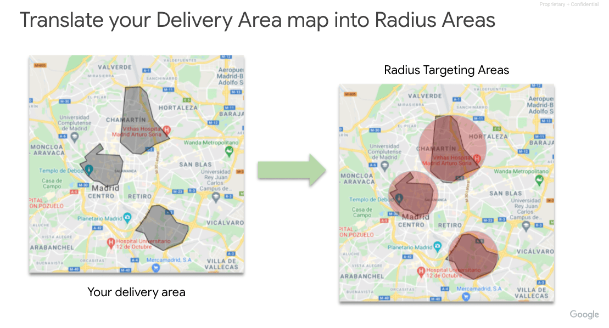
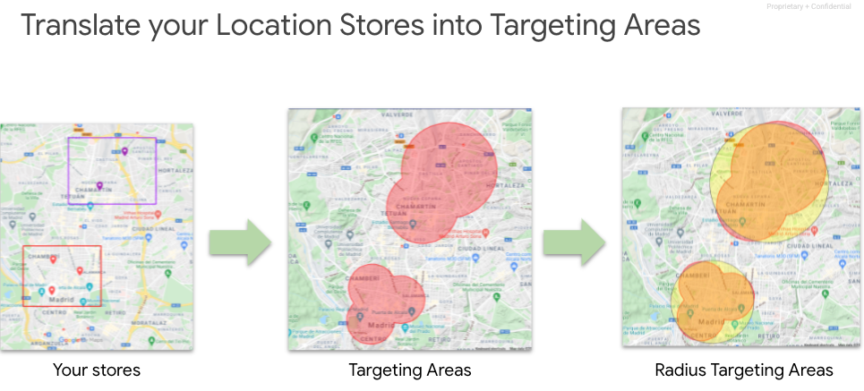
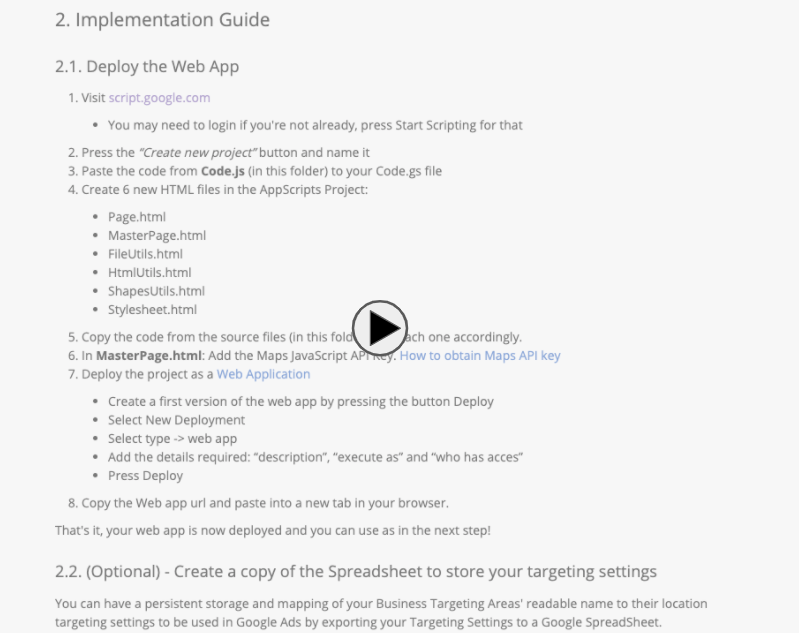
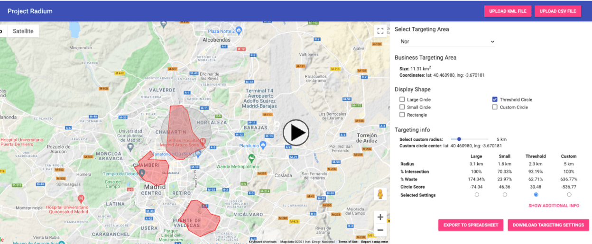

# Project Radius Geo Targeting aka Radium

<!--* freshness: { owner: 'nnajdova' reviewed: '2021-04-22' } *-->

Project “Radius Geo Targeting” (code name Radium) helps automatically generate
Google Ads radius targeting for given delivery areas.

Disclaimer: This is not an official Google product.

## Contents

- [1. Key Concepts](#1-key-concepts)
  - [1.1. Challenges of Google Ads geo targeting](#11-challenges-of-google-ads-geo-targeting)
  - [1.2. Solution overview](#12-solution-overview)
  - [1.3. Requirements](#13-requirements)
  - [1.4. Summary](#14-summary)
- [2. Implementation Guide](#2-implementation-guide)
  - [2.1. Deploy the Web App](#21-deploy-the-web-app)
  - [2.2. (Optional) - Create a copy of the Spreadsheet to store your targeting settings](#22-optional-create-a-copy-of-the-spreadsheet-to-store-your-targeting-settings)
- [3. How to use the tool](#3-how-to-use-the-tool)
  - [3.1. Create your map file](#31-create-your-map-file)
  - [3.2. Upload your map](#32-upload-your-map)
  - [3.3. Customize your radius targeting settings](#33-customize-your-radius-targeting-settings)
  - [3.4. Upload the targeting settings to Google Ads](#34-upload-the-targeting-settings-to-google-ads)
- [4. Changes to the code](#4-changes-to-the-code)

## 1. Key Concepts

### 1.1. Challenges of Google Ads geo targeting

1.  Advertisers are faced with the challenge of mapping their business area back
 to the available
Google Ads targeting options (i.e. City, Postal Code etc).
2.  Getting the ads geo targeting right is a manual and time consuming process
especially for advertisers that cannot benefit from city level or country level
targeting
due to not being able to cover the entire city or country.
3.  Very broad geo targeting leads to advertising to customers advertisers
cannot serve with their business.

### 1.2. Solution overview

This solution provides an advertiser or an agency a platform to translate the
map they operate their business into a map where their ads will be displayed.
One replication can be leveraged for multiple customers as the tool doesn’t save
any data it processes. It downloads a file locally that can be used directly in
Google Ads Editor for bulk upload of the locations it generates.

Delivery Area to Radius

Stores to Radius

### 1.3. Requirements
* Maps JavaScript API Key
* One of the following:
    * KML file representing the customer's targeting areas (See [sample](samples/sample_map.kml))
    * CSV file with lat-lng, radius and name of customer's targeting areas (more oriented to physical stores) (See [sample](samples/sample_csv.csv))

### 1.4. Summary

1. Skills Required: JavaScript & Maps API are the minimum requirements.
2. Google Products Used: Google Ads (primary), SA360, DV360, Studio
3. Estimated time to implement the solution: If no adjustments needed, not more than 1h.

## 2. Implementation Guide

Implementation Guide

### 2.1. Deploy the Web App

1. Visit [script.google.com](https://script.google.com/home/start)
   * You may need to login if you're not already, press Start Scripting for that
2. Press the *"Create new project"* button and name it
3. Paste the code from **Code.js** (in this folder) to your Code.gs file
4. Create 6 new HTML files in the AppScripts Project:
    * Page.html
    * GlobalPage.html
    * FileUtils.html
    * HtmlUtils.html
    * ShapesUtils.html
    * Stylesheet.html
5. Copy the code from the source files (in this folder) into each one accordingly.
6. In **GlobalPage.html**: Add the Maps JavaScript API Key. [How to obtain Maps API key](https://developers.google.com/maps/documentation/embed/get-api-key)
7. Deploy the project as a [Web Application](https://developers.google.com/apps-script/guides/web)
     * Create a first version of the web app by pressing the button Deploy
    * Select New Deployment
    * Select type -> web app
    * Add the details required: "description", "execute as" and "who has acces"
    * Press Deploy
8. Copy the Web app url and paste into a new tab in your browser.

That's it, your web app is now deployed and you can use as in the next step!

### 2.2. (Optional) - Create a copy of the Spreadsheet to store your targeting settings
You can have a persistent storage and mapping of your Business Targeting Areas' readable name to their location targeting settings to be used in Google Ads by exporting your Targeting Settings to a Google SpreadSheet.

In order to do so:
* Make a copy of [this Spreadsheet](https://docs.google.com/spreadsheets/d/1yLLgjJkvATAII_jJdAP4cIfqULB1dp99BPCl7zQvC9Q/edit?usp=sharing&resourcekey=0-boJqFBywVR5zYUdTUSOqvw)
* Update the `spreadsheetID` field in the **GlobalPage.html** file

## 3. How to use the tool

Radium Demo Video

### 3.1. Create your map file

***Tip: If you already have a map file in .kml or in .csv you can skip this step.***

1. Visit [mymaps.google.com](https://mymaps.google.com)
2. Create a map with your delivery areas aka business targeting areas
3. Click the burger menu on the right and select export to KML (make sure the KML checkbox is checked).

### 3.2. Upload your map

If your map file is in **KML format**:
1. Press the *"Upload KML File"* button
2. Upload your .kml file representing the map of your targeting areas
3. The map with your areas will be loaded in the UI

If your map file is in **CSV format**:
1. Press the *"Upload CSV File"* button
2. Upload your .csv file representing the map of your targeting areas
3. The map with your areas will be loaded in the UI

### 3.3. Customize your radius targeting settings
You can now customize in the UI per targeting area the desired radius targeting that will be applied

##### Display Shapes
* **Rectangle**: Rectangle that surrounds the targeting area
* **Large Circle**: Circle that englobes the previous rectangle
* **Small Circle**: Circle contained in the previous rectangle, touching its sides
* **Threshold Circle**: Minimum circle that targets at least the `intersectionTreshold` percentage of the targeting area (90% by default)
* **Custom Circle**: Circle which center and radius can be customized manually by drag&drop and using the controls of the UI

##### Targeting Info Metrics
To compare each circle you can see the following metrics in the UI:
* **Radius**: radius of the circle
* **% Intersection**: area of the Business Targeting Area inside the circle / total Business Targeting Area size 
* **% Waste**: area of circle excluding the Business Targeting Area / total Business Targeting Area size
* **Circle Score**: % Intersection - % Waste. The highest score represent the sweet spot, maximizing the targeting area and minimizing the waste area

By clicking in the *"Show Additional Info"* button, additional metrics are displayed:
* **Circle size**: area of the circle
* **Intersection size**: area of the Business Targeting Area
* **Waste size**: area of the circle excluding the Business Targeting Area

##### Selected Settings
You have to select one of the following Targeting Settings per Business Targeting Areas:
* Large Circle
* Small Circle
* Threshold Circle (selected by default)
* Custom Circle

This will be used to generate the Targeting Settings to be applied to Google Ads

### 3.4. Upload the Targeting Settings to Google Ads
At this point, there are 3 ways of uploading the Targeting Settings to Google Ads
* Download a .csv file and upload it using [Google Ads Editor](https://ads.google.com/home/tools/ads-editor/)
* Export data to a Spreadsheet and upload it using [Google Ads Editor](https://ads.google.com/home/tools/ads-editor/)
* Upload it manually using the Google Ads UI

##### Download csv and upload it using Google Ads Editor
If you download the Targeting Settings as a .csv file you can upload them to Google Ads via [Google Ads Editor](https://ads.google.com/home/tools/ads-editor/). To upload this CSV file into the [Google Ads Editor](https://ads.google.com/home/tools/ads-editor/), follow these steps:
1. **Account > Import > From file...** - This will upload a draft of the targeting settings into the specified campaigns
2. **Review Changes > Keep** - To make the changes permanent 

##### Export to Spreadsheet and upload it using Google Ads Editor
If you export the Targeting Settings into a Spreadsheet, you can use [Google Ads Editor](https://ads.google.com/home/tools/ads-editor/) to upload them to Google Ads, as well as having a maping of a readable name for each Targeting Settings.
To upload them using [Google Ads Editor](https://ads.google.com/home/tools/ads-editor/):
1. On the Spreadsheet, you will have stored in the *"Locations"* tab the mapping between all your locations and the targeting settings
2. In the *"Targeting Settings"* Tab, you can customize the account and campaign where you want to apply the Radius Targeting Settigns
3. Export this tab as CSV
4. Upload this CSV file into the Google Ads Editor, by clicking on:
    * **Account > Import > From file...** - This will upload a draft of the targeting settings into the specified campaigns
    * **Review Changes > Keep** - To make the changes permanent 

##### Manual upload through Google Ads UI
If you download the Targeting Settings as a .csv file you can upload them manually to Google Ads:
1. Visit the [Google Ads UI](https://ads.google.com)
2. Navigate to "Locations" menu
3. Select "Radius"
4. Enter the output you got from this tool, make sure you use comma between lat
and lng

Other Google Advertising products guides are coming soon.

## 4. Changes to the code

* **[Required] Minimum change is adding the Maps API Key for your cloud project.**
* [Optional] You could adjust the project parameters to match your project the
best.
* [Optional] You could change the format of the csv file output to match
different Ads Product requirements.
* [Optional] You could automate the entire process by [scheduling the script](https://developers.google.com/apps-script/guides/triggers/installable)
to check a [Google Drive](https://developers.google.com/apps-script/advanced/drive) folder for new files and once it finds to process them and
save the csv output to a [BigQuery table](https://developers.google.com/apps-script/advanced/bigquery). 
Let us know if you have this use case and we may be able to help you out with
development. 